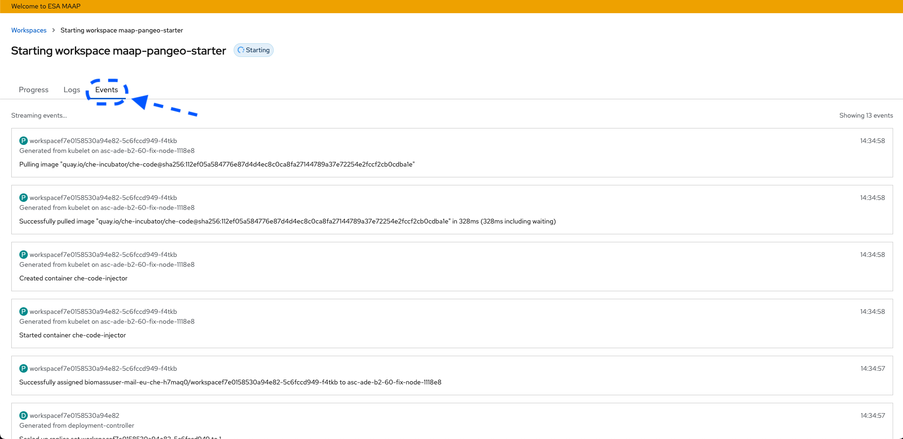
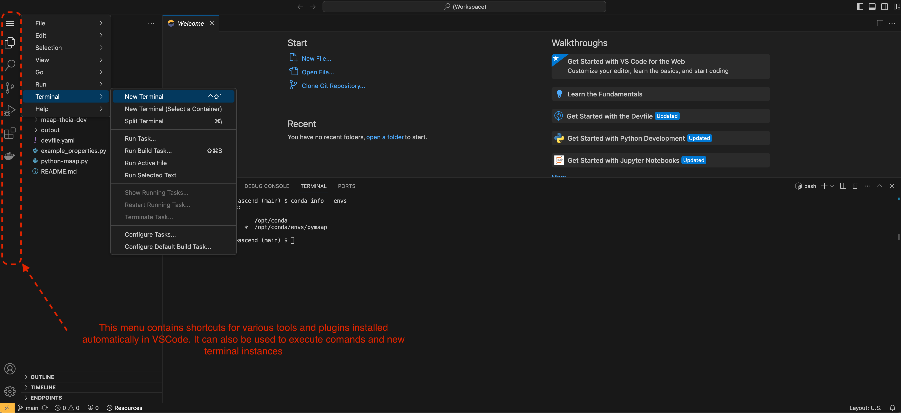
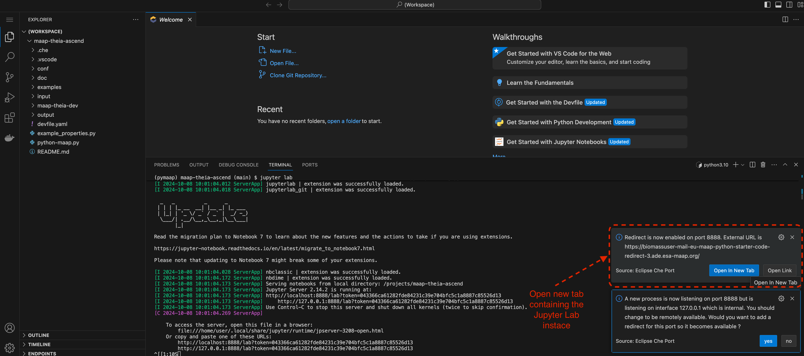

# Docker container for MAAP Eclipse Che workspace

This repository contains the Dockerfile and associated files for building a Docker container for the MAAP Eclipse Che workspace.
It is based on the Universal developer image UBI8 provided by Red Hat.
Workspace is running on Python 3.10.13 and conda environment.


# Building the Docker container
This workspace and associated Docker container are part of this repository. The `maap-theia-dev` folder contains the files
and Dockerfile needed to build the Docker container. The Docker container is built using the following command:
```bash
docker build --no-cache -t maap-theia-dev .
```

Once the image is built it can be uploaded to a Docker registry. The image can be uploaded to a Docker registry. An example can be found here:
```bash
docker tag maap-theia-dev quay.io/maap/maap-theia-dev
```

```bash
docker push quay.io/maap/maap-theia-dev
```

The resulting image can be used in the devfile.yaml file for the Eclipse Che workspace. See section [Devfile](#Devfile) for more information.

We should note that a Conda environment named `pymaap` will be created and activated once the container is started. This environment is based on Python 3.10.13 and contains the following packages:

  - folium=0.15.1
  - gitpython=3.1.40
  - ipyleaflet=0.18.1
  - jupyterlab=3.6.3
  - jupyterlab-git=0.34.2
  - jupyter-packaging=0.12.3
  - jupyterlab_widgets=3.0.7
  - nodejs=18.15.0
  - plotly=5.18.0
  - plotnine=0.12.2
  - plotnine=0.12.2
  - awscli=2.14.1
  - backoff=2.2.1
  - basemap=1.3.7
  - boto3=1.34.15
  - cython=3.0.7
  - earthengine-api=0.1.384
  - gdal=3.7.0
  - geocube=0.4.2
  - geopandas=0.14.2
  - h5py=3.9.0
  - hdf5=1.14.0
  - httpx=0.26.0
  - mapclassify=2.6.1
  - matplotlib=3.7.3
  - mizani=0.10.0
  - mpl-scatter-density=0.7
  - numba=0.58.1
  - numpy=1.26.3
  - pandas=2.1.4
  - pandarallel=1.6.5
  - pycurl=7.45.1
  - pygeos=0.14
  - pyogrio=0.6.0
  - pyproj=3.5.0
  - pystac-client=0.7.5
  - python=3.10.13
  - rasterio=1.3.7
  - rasterstats=0.19.0
  - requests=2.31.0
  - rio-cogeo=5.1.1
  - rtree=1.1.0
  - s3fs=0.4.2
  - scikit-learn=1.3.2
  - scipy=1.11.4
  - seaborn=0.13.1
  - shapely=2.0.1
  - sliderule=4.1.0
  - statsmodels=0.14.1
  - tqdm=4.66.1
  - unidecode=1.3.7
  - xmltodict=0.13.0
  - pip=23.3.2
  - jupyter-resource-usage==0.7.2
  - rio-tiler==6.2.8
  - morecantile==5.1.0

## List of files in Container

- `Dockerfile`: The Dockerfile for building the Docker container.
- `README.md`: This file.
- `LICENSE`: The license file for this repository.
- `entrypoint.sh`: The entrypoint script for the Docker container.
- `environment.yml`: The environment file for the conda environment.
- `initTemplates.sh`: ?? (decompresez an arhive with templates for Eclipse non Che)
- `sharedAlgorythms.sh`: Script for cloning git repository, guides user through git configuration.
- `ingestData.sh`: Script for fetching data based on configuration from project template.
- `ingestData.py`: Python script for fetching data based on configuration from project template.
- `maap-s3.py`: Python script for fetching data from MAAP S3 bucket.
- `RestClient.py`: ??.
- `installLib.sh`: fetches requirements.txt file from url and installs the packages. Packages are:
    - property
    - requests
    - namedlist==1.7
    - scikit-image
    - equi7grid==0.0.10
    - numpydoc==0.8.0
    - packaging==19.0
    - pyproj
    - pytileproj
    - scipy
    - matplotlib
    - pillow
    - pandas
    - Shapely
    - octave_kernel
    - fiona
    - scikit-learn

# IDEs
 In order to customize IDE edit the .che/che-editor.yaml file.
Current options are supported:
 - Eclipse Theia (VSCODE) (default)
```yaml
id: che-incubator/che-code/latest
```
- PyCharm (not tested)
```yaml
id: che-incubator/che-pycharm/latest
```
- IntelliJ IDEA (not tested)
```yaml
id: che-incubator/che-intellij/latest
```

# Devfile

The devfile is a configuration file that defines the workspace. It is used by Eclipse Che to create the workspace. The devfile for the MAAP Eclipse Che workspace is located in this repository. 
The devfile is named `devfile.yaml`. 

Users can define the workspace by editing the devfile. The devfile contains the following sections:
- `metadata`: Contains metadata about the workspace.
- `attributes`: Contains attributes for the workspace.
- `components`: Contains information about the components in the workspace.
- `commands`: Contains information about the commands in the workspace.
- `plugins`: Contains information about the plugins in the workspace.

The `attributes` section can be used to define what plugins are installed in the workspace. The `plugins` section can be used to define what plugins are installed in the workspace. The `components` section can be used to define what components are installed in the workspace.
Currently we have the following plugins:
```yaml
attributes:
   .vscode/extensions.json: |
      {
         "recommendations": [
            "redhat.java",
            "ms-python.python",
            "ms-toolsai.jupyter",
            "ms-azuretools.vscode-docker",
            "redhat.vscode-yaml",
            "ms-azuretools.vscode-docker"
         ]
      }
   .che/che-theia-plugins.yaml: |
       - id: redhat/vscode-yaml
       - id: ms-python/python
       - id: ms-toolsai/jupyter
```

Alternatively, the `extensions.json` and `che-theia-plugins.yaml` files can be used to define in the `.vscode` and `.che` folders respectively. Both methods are used for demonstration in this repository.

In the `components` section we define the container to be used, the one defined in the [Container](#Building the Docker container) sections of this readme.
Here users can also define parameters such as CPU and memory limits for the workspace. 

The `commands` section can be used to define what commands are available in the workspace. 

# Adding workspace to Eclipse Che

## Manual
Eclipse Che only requires a valid devfile to create a workspace. The devfile for the MAAP Eclipse Che workspace is located in this repository. Thus, we can just specify
the URL of this repository in  Eclipse Che workspace creation textbox.

## Kubernetes ConfigMap
Alternatively, if we have administrator access to Eclipse Che, we can add the workspace to the list of available workspaces in the `getting-started-sample` Kubernetes configmap. We can use `kubectl` as follows:

```bash
kubectl create configmap getting-started-samples --from-file=maap_sample.json -n eclipse-che
```

```bash
kubectl label configmap getting-started-samples app.kubernetes.io/part-of=che.eclipse.org app.kubernetes.io/component=getting-started-samples -n eclipse-che
```

Please note that some of the commands above may require administrator access to the Kubernetes cluster and the Eclipse Che namespace.

An example of the `maap_sample.json` file is provided in this repository. The file contains the following information:
```json
[
  {
    "displayName": "MAAP Python 3.10.13",
    "description": "Python 3.10.13 sample MAAP using vanilla environment",
    "tags": "maap, python 3.10.13",
    "url": "https://github.com/igabriel85/maap-theia",
    "icon": {
      "base64data": "<base64_encoded_data>",
      "mediatype": "image/png"
    }
  },
  {
    "displayName": "MAAP Jupyter Python 3.10.13",
    "description": "Python 3.10.13 sample MAAP using Jupyter environment",
    "tags": "maap, python 3.10.13",
    "url": "https://github.com/igabriel85/maap-jupyter",
    "icon": {
      "base64data": "<base64_encoded_data>",
      "mediatype": "image/png"
    }
  }
]
```
For custom icons, we must convert the image data into base64 encoding. We can use online tools such as [base64-image.de](https://www.base64-image.de/) to convert the image data to base64 encoding.

## Devfile Registry

We can also create a custom devfile registry. This registry contains the devfile for the MAAP Eclipse Che workspace. It will enable complete controll over what sample workspaces are available in Eclipse Che. The other methods will just add the workspace to the list of available workspaces in Eclipse Che.
For a complete overview of how we can use the Devfile Registry, please refer to the [MAAP Eclipse Che devfile registry](https://gitlab.dev.info.uvt.ro/sage/maap/che-dev-file-registry).

Note that in newer  versions of eclipse che, the devfile registry is not supported anymore, the getting started samples are taken from [registry.devfile.io](https://registry.devfile.io/viewer).
Additional samples such as the ones developed for ESA MAAP will have to be added using the above mentioned configmap method.

# How to use Eclipse Che

Eclipse Che is a cloud-based IDE that allows users to develop, build, and run applications in the cloud. It provides a web-based interface that allows users to create and manage workspaces. Workspaces are containers that contain all the tools and dependencies needed to develop, build, and run applications.
It is deigned aroun the concept of a devfile, which is a configuration file that defines the workspace. The devfile contains information about the components, commands, and plugins in the workspace. The devfile is used by Eclipse Che to create the workspace.

After login users can create a new workspace by clicking on the `Create Workspace` button. They can then select the `VSCode MAAP Python 3.10.5` workspace from the list of available workspaces. The workspace will be created and the user can start developing their application.
Please note that you will need to use a sample workspace or alternatively users can import additional projects from git repositories.


Once a workspace has been selected Eclipse Che will start deploying this workspace. Users can view the progress of the deployment in the `Progress` tab. 
Logs are also avaibale on a per component basis in the `Logs` tab. For additional information regarding the workspace, deployment events can be viewed in the `Events` tab.


Progress Tab:


Events Tab:


Once the workspace has been successfully deployed, users can start developing their application. They can create new files, edit existing files, and run commands in the terminal. They can also use the built-in code editor (default is VS Code) to write and edit code. The code editor provides features such as syntax highlighting, code completion, and code navigation. 
Capabilities are identical to the ones provided by the desktop version of VS Code, including plugin support:


Users can also run commands in the terminal. The terminal provides a command-line interface that allows users to run commands, install packages, and manage files. Users can also run build and test commands in the terminal. The terminal provides a command-line interface that allows users to run commands, install packages, and manage files:




We should note at this stage that the workspace start with a default conda environment called `pymaap` or `base` depending on the underlying image. While users are able to install
additional packages via the terminal this environment might not be persistent, and could be reset between workspace restarts. For persistent environments users should create a new conda environment
in a location where PVC are mounted. By default these locations are accessible via the `HOME` and `PROJECT_SOURCE` environment variables. In the case of this workspace these locations are `/home/user` and `/projects/maap-theia-ascend` respectively.

For creating a new conda environment users can use the following command:
```bash
conda create -n myenv python=3.10.13
```

This command will create the `myenv` environment with Python version 3.10.13 in the default location defined by `$PROJECT_SOURCE/envs` folder.

If a different location is preferred, users can specify the location by using the following command:
```bash
conda create -p /path/to/envs/myenv python=3.10.13
```

Note that if this environment is not placed inside one of the persistent volume mounts it will be reset between workspace restarts.

In order to activate the environment users can use the following command:

```bash
source activate myenv
```

Users can also start a Jupyter Lab server by running the following command:
```bash
jupyter lab --ip=0.0.0.0 --port=8888 --no-browser --allow-root
```

Once Jupyter is started Eclipse Che will detect that a server is running on port `8888` and will prompt the user to open the server in a new browser tab:



If the user selects this a new tab will open in browser with the Jupyter lab instance:


We should note that the Jupyter Lab instance is running in the same container as the workspace. 
If the entrypoints are not explicitly set in the devfile as being secured with the attribute `urlRewriteSupported: true` the Jupyter Lab instance will not use JWT tokens for authentification, the endpoint will be `publically` `accesible`. 
The only security measure is the token/password set during the startup of the Jupyter Lab instance.

An alternative is to use the Jupyter plugin for VS Code. This plugin provides a Jupyter Notebook interface in the VS Code editor. Users can create new notebooks, edit existing notebooks, and run code cells in the notebook. The plugin provides features such as syntax highlighting, code completion, and code navigation:


Workspaces can be stopped, restarted, and deleted using the buttons in the workspace view. Users can also view the logs and events for the workspace. The logs provide information about the workspace, such as the components that are running and the commands that have been executed. The events provide information about the workspace, such as when it was started, stopped, or deleted:


# ToDos
- [x] initial functionality test.
- [x] test S3fs mountpoints
- [ ] test additional scientific applications
- [ ] full scale functionality test